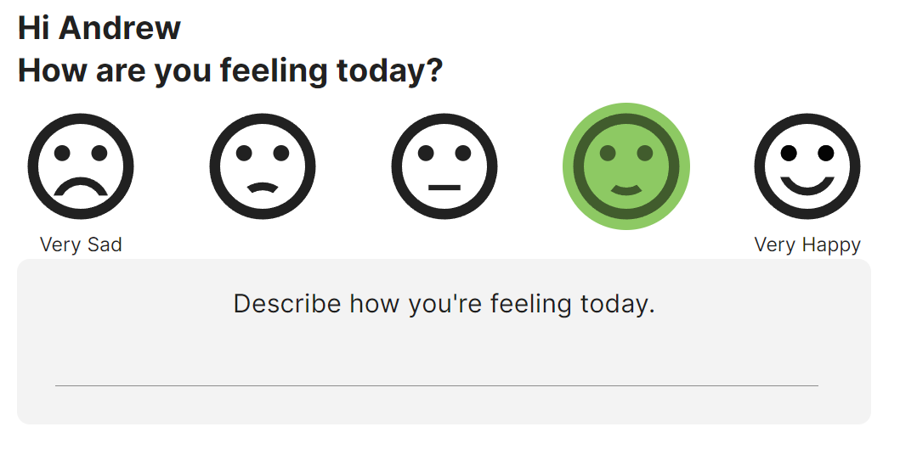
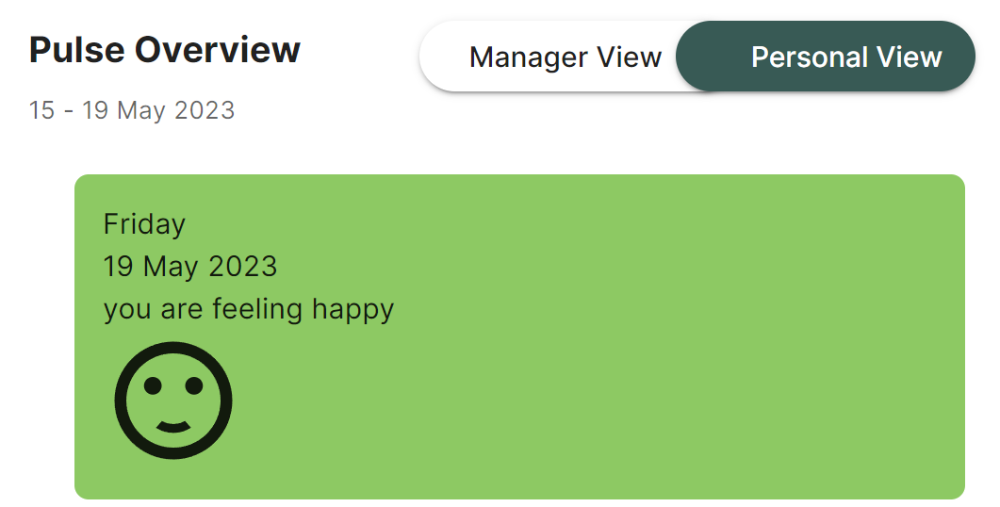
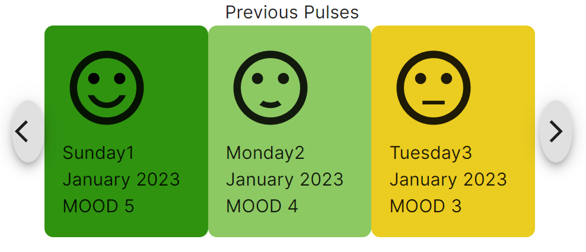
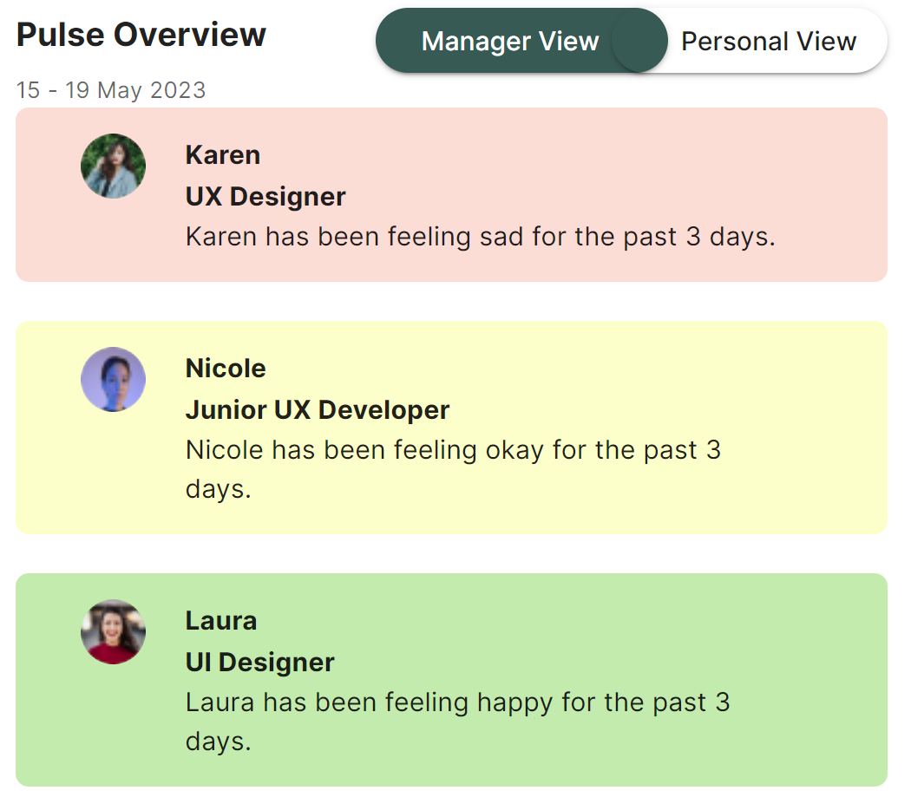

# backend

## Bump

Bump is a corporate app designed to facilitate effective communication between managers and their reports. It provides a platform for managers and employees to discuss topics such as job performance, workplace concerns, and general well-being through mood logging. With Bump, teams can enhance their communication, leading to better collaboration and a healthier work environment.

## Features

### Login

### Dashboard View

- Mood selector
  1. Checks for the date and register the 'mood' selection from the user input.
  2. Update the user database.
  3. Update the 'mood' data in the database if the user changes input for the current day.
  4. Schedule a function at the end of each day to register the final updated 'mood' input for the day to the database.

- Pulse overview (Personal view)
  1. Retrieve the latest 'mood' data for the individual user.

- Previous pulses
  1. Retrieve the last 3 user's 'mood' data of the array.

- Pulse overview (Manager view)
  1. Filter through the user database to find users(direct reports).
  2. Filter through the users (direct reports) to find the user with 5 consecutive low 'mood' rating.
  3. It will return the users (direct reports) that meets the conditions.

### Message
The Message Component utilises 3 databases: 1. the user database, 2. the chats database, and 3. the contentbank database. 
1. user database - to access basic informatiom of the user and who they can communicate with. 
2. chat database - to retrieve and upload chat messages
3. contentbank database - to retrieve the pre populated message content and prompting questions.

## Technologies Used

- Express.js: The server-side of Bump is built with Express.js, a flexible web application framework for Node.js, which provides a robust and scalable backend infrastructure.
- Node.js: Bump is powered by Node.js, a runtime environment that allows running JavaScript on the server-side, facilitating seamless communication between the frontend and backend.
- MongoDB: Bump leverages MongoDB, a NoSQL database, to store user data, mood logs, and messages. MongoDB offers scalability and flexibility in handling data storage needs.
- Mongoose: Mongoose is an Object Data Modeling (ODM) library for MongoDB and serves as the communication layer between the application and the database. It simplifies data manipulation and provides an easy-to-use API.
- "node-schedule" is an open-source package that provides a powerful scheduling library for Node.js applications.
